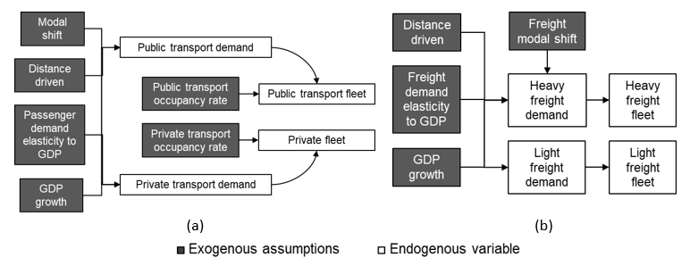

.. sectnum::
   :start: 3
.. _chapter-Parameterization:
Parameterization
=====

Previously we mentioned where to adjust the InputActivityRatio and
OutputActivityRatio (Section 2.2). Here we describe the rest of the OSeMOSYS
parameters. Modelers must populate files 8 to 10 that A1_Mode_Structure.py produces,
i.e., A-O_Demand.xlsx, A-O_Fleet.xlsx, and A-O_Parametrization.xlsx.

This section explains four groups of parameters:

- Exogenous demands

- Fleet composition assumptions

- Primary technologies

- Secondary, transport, and other technologies

After parameterizing the files, modelers must execute ``A2_Compiler.py``,
resulting in new Microsoft Excel files with the substring "COMPLETED" in the
name. These files have the projected values for each parameter and technology.

The ``A2_Compiler.py`` also produces a comma-separated file for each parameter,
stored inside the A2_Output_Params folder. Some parameters have files with default
values, also entered in B1_Default_Param.xlsx by the modelers (see :ref:`Figure 1 <figure1>`).
The modelers must manually copy and paste the comma-separated files to the
A2_Output_Params folder for each scenario.

Exogenous demands
------------

We extract sectors' demands with simple approaches from the first model
version [1], which uses historical data to predict future years.
This approach results in an electrical energy intensity drop of 25%, considering a 3% potential GDP growth.

We link GDP growth as the main driver of energy and transport demand change
for sectors with detailed approaches. We estimate demand elasticities with
fleet data between 2015 and 2019 from Ministry of Finance data for transport.
These estimates are a reference point to understand the current coupling
between transport activity and economic growth [8].

We considered the effects of the COVID-19 pandemic on passenger mobility in
2020 by changing the distance traveled during that year and assumed a gradual
recovery to 2019 levels until 2023. We assumed freight distance traveled remained unchanged.

   **Figure 9.** Variable interaction of transport modeling.

Figure 9 illustrates the variable interactions defined in Equations 1 to 6 of
the research article.  Table 11 explains data sources for key parameterization of demands.

**Table 11.** Model input references for demand modeling.

.. table:: 
   :align:   center
+------------------------------------------------------------------------------------+--------------------------------------------------------------------------------------------------------------------------------------------------------+
| Model component                                                                    | Source                                                                                                                                                 |
+====================================================================================+========================================================================================================================================================+
| Occupancy rates                                                                    | We use a national transport survey from 2013 [11]                                                                                                      |
+------------------------------------------------------------------------------------+--------------------------------------------------------------------------------------------------------------------------------------------------------+
| Driven distance by vehicle type                                                    | Costa Rica's technical revision entity [12]                                                                                                            |
+------------------------------------------------------------------------------------+--------------------------------------------------------------------------------------------------------------------------------------------------------+
| Energy intensity by demand sector                                                  | Costa Rica's energy balances [13]                                                                                                                      |
+------------------------------------------------------------------------------------+--------------------------------------------------------------------------------------------------------------------------------------------------------+
| Gross Domestic Product to drive demands and normalize expense and revenue results  | We use official and publicly available GDP time series[20] and assume that all costs are in USD using the reported yearly average exchange rate [21].  |
+------------------------------------------------------------------------------------+--------------------------------------------------------------------------------------------------------------------------------------------------------+

To enter demand into the modeling framework, we use A-O_Demand.xlsx (file 8).
It consists of a single sheet with a table to define projections, having the
same capabilities described in Section 2.3. The transport demands have special
commands under the "Projection.Mode" column that contain the "GDP coupling" substring.

For transport technologies, we enter the base year's fleet, occupancy rate,
and distance driven. Then we enter the percentual distribution of demand production.
For example, according to base year data calibration, SUVs produce 30%, sedans 56%,
and motorcycles 14% of private transport demand data.

Simple approach sector demands and industry demands have user-defined projections,
which means they must be calculated externally. For industry, a distribution
input of 100% must be defined for group technologies. For example,
boilers produce 100% of steam for all industries.

Fleet composition assumptions
------------

The baseline fleet distribution projection is in A-O_Fleet.xlsx (file 9).
It consists of a single sheet with a table that must contain all the transport
groups and the corresponding disaggregated (i.e., per fuel) transport technologies.
This table indicates the ``A2_Compiler.py`` to convert the demand of the entire
period into the fleet.

Taking the residual capacity parameter (explained in Section 3.4), ``A2_Compiler.py``
internally defines the base year fleet distribution (e.g., percent of
gasoline and diesel SUVs). Moreover, it takes the fleet "Target Year"
and "Target Value" from A-O_Fleet.xlsx for every available technology.
With these values, the penetration percent of each technology is translated
into a fixed capacity for OSeMOYS to execute.

For vehicle technologies, we use two types of restrictions defined in A-O_Fleet.xlsx.
A "Lower" restriction defines the **TotalAnnualTechnologyActivityLowerLimit**
and ensures the technology will reach at least the specified target. A "Hard"
restriction makes the **TotalAnnualTechnologyActivityLowerLimit**
and the **TotalAnnualMaxCapacity** reach exactly the specified target.
Combining these two parameters is the lever to model scenario differences.
Finally, if a technology does not have a restriction, it will be free to satisfy
a demand if it is cost-optimal.

Primary technologies
------------

The remaining parameters must be entered in A-O_Parameterization.xlsx (file 10).
This file has eleven sheets. To parameterize primary technologies, modelers
must modify the Fixed Horizon Parameters and Primary Techs sheets only.

For reference, primary technologies are listed in Table 2. Table 12 summarizes
input data sources. The **ResidualCapacity** of power plants corresponds to the
existing installed capacity per technology. The **TotalAnnualMaxCapacity**
(henceforth, maximum capacity) and **TotalAnnualMinCapacity**
are used to define the planned capacity of existing plans.

**Table 12.** Model input references for primary technologies.

.. table:: 
   :align:   center

+------------------------------------------------------------------------------+-----------------------------------------------------------------------------------------------------------------------------------------------------------------------------------------------------------+
| Model component                                                              | Source                                                                                                                                                                                                    |
+==============================================================================+===========================================================================================================================================================================================================+
| LPG  infrastructure characterization                                         | U.S. Department of Energy [8]                                                                                                                                                                             |
+------------------------------------------------------------------------------+-----------------------------------------------------------------------------------------------------------------------------------------------------------------------------------------------------------+
| Biofuel blend for biodiesel and ethanol                                      | RECOPE's (the national fuel state-owned monopoly) biofuel strategy [15]                                                                                                                                   |
+------------------------------------------------------------------------------+-----------------------------------------------------------------------------------------------------------------------------------------------------------------------------------------------------------+
| International fuel prices: present and projection                            | National statistics from RECOPE's website [16] for years up to 2020, and the trajectory of oil prices suggested by the IEA in the 2019 World Energy Outlook [17], which we take at 1.9% growth annually.  |
+------------------------------------------------------------------------------+-----------------------------------------------------------------------------------------------------------------------------------------------------------------------------------------------------------+
| Capacity factor of bioenergy power generation in 2050                        | We model a transition from a bagasse-based option with energy balance to IRENA's characterization [18].                                                                                                   |
+------------------------------------------------------------------------------+-----------------------------------------------------------------------------------------------------------------------------------------------------------------------------------------------------------+
| Capacity factor and costs of geothermal, hydro run-of-river, and dam         | Personal communication with the Instituto Costarricense de Electricidad (ICE)                                                                                                                             |
+------------------------------------------------------------------------------+-----------------------------------------------------------------------------------------------------------------------------------------------------------------------------------------------------------+
| Future capacity factors aligned with the National Generation Expansion Plan  | ICE's 2019 Generation Expansion Plan [19]                                                                                                                                                                 |
+------------------------------------------------------------------------------+-----------------------------------------------------------------------------------------------------------------------------------------------------------------------------------------------------------+

With OSeMOSYS, the power plant type choice depends on the relative costs of
competing technologies for least-cost optimality and user-specified
restrictions linked to a scenario. We prevent the model from incorporating
additional hydro and geothermal capacity for the National Decarbonization
Plan simulation, besides the specified capacity in ICE's 2019 Generation
Expansion Plan [23] to 2034. Only one of the Renewable Options scenarios
considers hydropower and geothermal as main options.

We limit the maximum annual capacity investments of solar utility-scale to
1 GW per year and a maximum total capacity of 2 GW starting in 2031.
With storage, this maximum capacity rises to 4 GW. Distributed solar power
generation has the same maximum capacity restrictions for with and without storage options. 

Recent national power generation plans have found that 0.1% of unprotected has
the potential of over 500 MW of capacity. Keeping this proportion, the land use
for solar generation could be up to 2.4% of unprotected coverage, half of which
could be shared with urban areas as rooftops.

Similarly, we constrain onshore wind to a maximum of 5 GW by 2050, in
line with the identified potential for the country [24]. The model
chooses the cheapest of all available options until the maximum capacity
is reached. We do not consider offshore wind, which has a potential of 15 GW [24].

Secondary, transport, and other technologies
------------

Here we explain the remaining sheets in the A-O_Parameterization.xlsx (file 10) workbook:

- Secondary Techs: has parameters of some of the technologies in Table 2; i.e.,
  power transmission, distribution, hydrogen production, and distribution.

- Demand Techs: the technologies are in Table 3 and do not have associated
  costs or residual capacity.

- Transport Fuel Distribution: has the technologies are in Table 4. Only
  electric vehicle chargers are modeled in sets T4ELE_PUB and T4ELE_HEA.

- Vehicle Techs: has the technologies of Table 5. Here the costs and 
  **ResidualCapacity** (or residual capacities) of each vehicle type must be inputted,
  corresponding with the base year number of vehicles. The costs can be entered either
  as an absolute value per vehicle or a value relative to another vehicle type;
  to define a value relative to another technology, type "Relative to" the technology
  under the "Unit.Introduced" column. Cost projections can be entered relative to
  the base year by typing "User defined trajectory relative to BY" under the
  "Projection.Mode" column.

- Vehicle Groups: has the technologies of Table 6. Modelers only must type
  "According to demand" under the "Projection.Mode" column.

- Industry Fuel Distribution: has the technologies of Table 7. These sets do
  not need additional cost or residual capacity parameters: modelers may enter
  "EMPTY" under the "Projection.Mode" column or leave a blank.

- Industry Techs: has the technologies of Table 8. The residual capacities and
  end-use characterization derive from Ministry of Energy and Environment studies [25], [26].

- Industry Groups: has the technologies of Table 9. Modelers only must type
  "According to demand" under the "Projection.Mode" column.

- Other: has the technologies of Table 10. Its table is useful to enter
  specific parameters for technologies that had not been defined. It also helps
  define previously undefined technologies. For example, detailed passenger rail
  costs are isolated technologies independent of other variables, which we define
  in this sheet for the decarbonization scenario.

Importantly, regardless of technology, the Fixed Horizon Parameters sheet was
the **OperationalLife** parameter. Another parameter in the sheet is
**CapacityToActivityUnit**; it converts GW of capacity to PJ of energy with a
conversion of 31.536 if that power was used throughout the year. The
**InputActivityRatio** and **OutputActivityRatio** parameters were inputted
in Section 2.2. For the rest of the parameters, Table 13 shows the sources
for technologies or specific technology parameters.

**Table 13.** Model input references for secondary, transport, and other technologies.

.. table:: 
   :align:   center
+----------------------------------------------------------------------+--------------------------------------------------------------------------------------------------------------------------------------------------------------------------------------------------------------------------------------------------------------------------------------------------------------------------------------------------------------------------------------------------------------------------------------------------------------------------------------------------+
| Model component                                                      | Source                                                                                                                                                                                                                                                                                                                                                                                                                                                                                           |
+======================================================================+==================================================================================================================================================================================================================================================================================================================================================================================================================================================================================================+
| Hydrogen and battery electric vehicle charging infrastructure        | The International Council on Clean Transportation [27]. For heavy-duty freight vehicles, we take costs for ultra-fast battery-electric vehicle chargers. For buses, we use a study for the public service regulator (report unavailable) to account for battery packs for extended journeys and a combination of 50 kW and ultra-fast chargers. Finally, we assume all private vehicle charging is done without a fast charger and that charger costs are included in the vehicle capital cost.  |
+----------------------------------------------------------------------+--------------------------------------------------------------------------------------------------------------------------------------------------------------------------------------------------------------------------------------------------------------------------------------------------------------------------------------------------------------------------------------------------------------------------------------------------------------------------------------------------+
| Hydrogen electrolyzer characterization                               | IRENA'S "Hydrogen from renewable power: outlook for the energy transition" [28]                                                                                                                                                                                                                                                                                                                                                                                                                  |
+----------------------------------------------------------------------+--------------------------------------------------------------------------------------------------------------------------------------------------------------------------------------------------------------------------------------------------------------------------------------------------------------------------------------------------------------------------------------------------------------------------------------------------------------------------------------------------+
| Vehicle operational life                                             | Costa Rica's technical revision entity [10]                                                                                                                                                                                                                                                                                                                                                                                                                                                      |
+----------------------------------------------------------------------+--------------------------------------------------------------------------------------------------------------------------------------------------------------------------------------------------------------------------------------------------------------------------------------------------------------------------------------------------------------------------------------------------------------------------------------------------------------------------------------------------+
| Vehicle efficiencies                                                 | We combine the energy balance [11] with the kilometers traveled to obtain the energy consumption per kilometer for every category of existing technologies. Vehicles without significant data for an estimate are kept from the first OSeMOSYS-CR version [1].                                                                                                                                                                                                                                   |
+----------------------------------------------------------------------+--------------------------------------------------------------------------------------------------------------------------------------------------------------------------------------------------------------------------------------------------------------------------------------------------------------------------------------------------------------------------------------------------------------------------------------------------------------------------------------------------+
| Industry technology cost inputs, efficiencies, and operational life  | A study commissioned for the Business, Energy and Industrial Strategy Department of the United Kingdom Government [29]                                                                                                                                                                                                                                                                                                                                                                           |
+----------------------------------------------------------------------+--------------------------------------------------------------------------------------------------------------------------------------------------------------------------------------------------------------------------------------------------------------------------------------------------------------------------------------------------------------------------------------------------------------------------------------------------------------------------------------------------+
| Freight rail costs and energy consumption                            | Report for the Netherlands on costs per ton-kilometer [30] and rail electricity consumption from Spain [31]; there is no detailed information for Costa Rica.                                                                                                                                                                                                                                                                                                                                    |
+----------------------------------------------------------------------+--------------------------------------------------------------------------------------------------------------------------------------------------------------------------------------------------------------------------------------------------------------------------------------------------------------------------------------------------------------------------------------------------------------------------------------------------------------------------------------------------+
| Fleet characterization and vehicle costs                             | Fleet size and costs are derived from Costa Rica's Ministry of Finance (personal communication; dataset unavailable). We use imports data to determine an average import price per vehicle. Future vehicle cost trajectories and maintenance costs are used as in the first model version [1]. As a rule, maintenance costs of zero-emission vehicles are a third of their combustion counterparts. We consider battery costs in electric vehicles to be included in their purchase cost.        |
+----------------------------------------------------------------------+--------------------------------------------------------------------------------------------------------------------------------------------------------------------------------------------------------------------------------------------------------------------------------------------------------------------------------------------------------------------------------------------------------------------------------------------------------------------------------------------------+
| Passenger rail and urban interventions                               | Financial analysis of Costa Rica's passenger rail project [32]                                                                                                                                                                                                                                                                                                                                                                                                                                   |
+----------------------------------------------------------------------+--------------------------------------------------------------------------------------------------------------------------------------------------------------------------------------------------------------------------------------------------------------------------------------------------------------------------------------------------------------------------------------------------------------------------------------------------------------------------------------------------+
