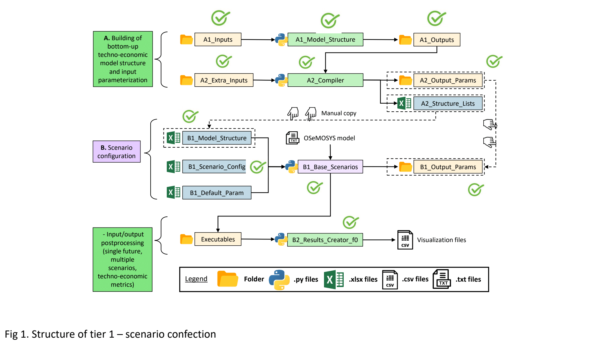

Overview
=====
.. class:: justify
We expand the first version of the OSeMOSYS-CR model [1] with three objectives. First, we add a representation of the energy transformation technological chain in the industrial sector, i.e., the collection of firms that consume energy to manufacture goods. Previously, only the energy supply and transport sectors were included. Second, we reformulate the model to link it to gross domestic product (GDP) growth as the driver of end-use energy or transport demands. Third, we present a toolset to flexibly create the model and multiple scenarios under the OSeMOSYS paradigm.

OSeMOSYS is a bottom-up Energy System Optimization Model (ESOM) platform that supports long-term energy planning [2], [3]. OSeMOSYS-CR [1] is the ESOM used to inform the cost-benefit analysis [4] of Costa Rica's National Decarbonization Plan [5]. This model version, OSeMOSYS-CR-v2, has supporting Python-based software programs that facilitate the creation, parameterization, and analysis of multiple scenarios. Figure 1 shows the interaction of the supporting software programs.

   Figure 1: Diagram of supporting software tools of OSeMOSYS-CR-v2.

The first component of the toolset is A. Building of bottom-up techno-economic model structure and input parameterization. It comprises Microsoft Excel files containing inputs for A1_Mode_Structure.py and A2_Compiler.py, which create all the necessary model sets, connections, and adequate parameterization for a Business-as-Usual scenario, i.e., a scenario without energy transformations. The second component is B. Scenario configuration, which contains Microsoft Excel files that indicate parameter changes performed by B1_Base_Scenarios.py to reflect transformation scenarios, execute OSeMOSYS, and obtain results. Finally, B2_Results_Creator_f0.py converts all input and output data into two comma-separated files (inputs and outputs) for convenient data visualization.

We explain OSeMOSYS-CR-v2 in four sections for a step-by-step setup and scenario creation guide:

1.	The model structure section shows the technological options we model.
2.	The parameterization section elaborates on the assumptions and data inputs, including exogenous demand equations.
3.	The scenario modeling section shows the tool component to create the multiple scenarios in "Prioritizing policy options to transform energy systems: aligning decarbonization and production sophistication in Costa Rica."
4.	The OSEMOSYS-CR-v2 execution guide summarizes the modeling process in simple steps.

